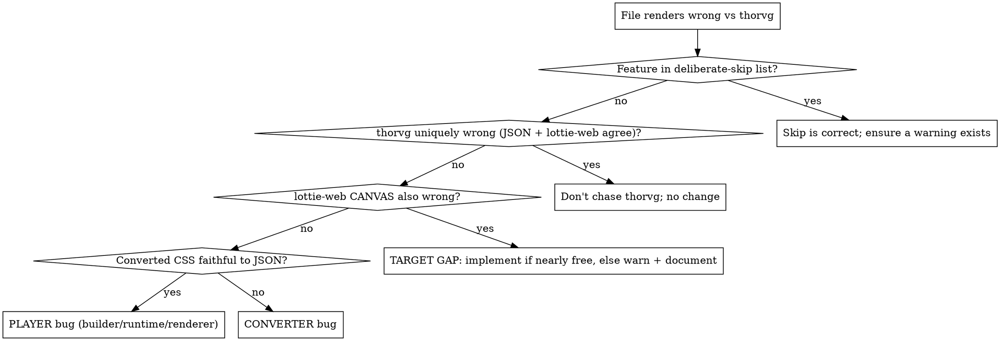

# Achieving Lottie Parity

## Overview

Popkorn targets parity with Lottie players in *rendering and animation
capability*. Every "this file looks wrong" task is a **triage problem first,
fix second**: the same symptom can be a converter bug, a player bug, a
deliberate skip, or a documented limitation — and each has a different
correct response. Never fix before classifying.

**Core principles (learned the hard way):**
- **Two reference players, two roles.** **thorvg is the parity TARGET** —
  the quality bar Popkorn aims to match. **lottie-web *canvas* is the
  FLOOR** — never render worse than it — and the sanity cross-check:
  thorvg has its own failures, so before chasing a thorvg-only behavior,
  confirm it against the source JSON's intent (if lottie-web and the JSON
  agree and thorvg disagrees, thorvg is the one that's wrong). Matching
  lottie-web but falling short of thorvg is not "done" — it's a **target
  gap**: implement if the nearly-free rule allows, otherwise record it as
  a warned, documented gap rather than silently calling it correct.
- **Warnings are the scoreboard.** A silent drop is always a bug, even when
  the drop itself is a deliberate skip. `warnOnce(...)` every discard.
- **CSS idiom first** when adding anything to the DSL: use the real CSS
  property if one exists, then SVG/SMIL lineage, and only then coin syntax.
  (Precedents used: `:state()`, `@container style()` guards, SMIL
  `target.event` triggers, `animation-timeline`. Rejected: adopting CSS
  `scroll()` because its browser meaning didn't match ours — a borrowed
  spelling that lies is worse than a new name.)
- **Measure, don't eyeball-guess.** The tools below give frame-accurate or
  sampled-numeric truth cheaply. "Screenshots lie less than tests" for
  visuals; sampled curves lie less than screenshots for motion.

## Triage: classify before touching anything

Deliberate skips (CLAUDE.md is authoritative): JS expressions, text
animators, merge-path subtract/intersect (union IS supported),
offset/zig-zag/pucker/round-corner modifiers, 3D/camera, most layer effects.
Not a skip: precomp time remap (layer `tm`) converts to `time-remap`. **Overturning a skip** requires
showing it's *nearly free*: implementable by reusing existing machinery (the
offscreen compositor, the channel plumbing, a native `ctx` capability) with
no new subsystem and no new dependency (blur qualified: `ctx.filter` + the
existing compositor). "The file needs it" alone does not.

Quick probe before firing up the harness: lottie-web *canvas* is known to
drop all layer effects (blur/glow/shadow) — an effects-shaped symptom where
thorvg renders the effect is a classic TARGET GAP (that's how
`filter: blur()` got in). Anything geometry/paint/timing-shaped, assume
both references render it and keep triaging toward a real bug.

Marker-driven interactivity (named segments a host app plays) is not a
conversion target at all — it maps to a hand-authored `@machine` scene
(see docs/state-machines.md). Markers are playback metadata, not rendering;
dropping them needs no warning.

## Investigation playbook

Always in this order; each step is cheap and eliminates guesswork.

1. **Convert with validation** (quote filenames — many have spaces/parens):
   `bun packages/popkorn-converters/src/cli.ts "examples/lottie/<file>.json" --validate`
   Capture warnings and blocked features. `validate: ok` does NOT mean
   correct — the worst bugs are silent visual wrongness.
2. **Feature inventory via jq.** Grep the JSON for markers:
   `ty:0` precomp · `ty:3` null · `ty:4` shape · `ty:5` text ·
   shape items `sh/gr/fl/st/gf/gs/tr/rc/el/sr` · `tm` trim (shape) or
   time-remap (layer) · `tt`/`td`/`tp` track mattes · `rp` repeater ·
   `mm` merge · `ef` effects · `masksProperties` · `markers` ·
   `.x` string fields = expressions. Count each; this tells you which
   converter paths execute before you read any code.
3. **Pin the symptom concretely.** Diff converted CSS against the source
   JSON at specific values (a keyframe, a gradient stop, a matte target) —
   most converter bugs are visible as a wrong/missing declaration.
4. **Frame-accurate visual truth:** the comparison harness at
   `tools/harness/` (read its README) renders popkorn vs lottie-web
   side-by-side; sample pixels at specific (x, y, t) to compare numerically.
   If another agent is editing shared files, snapshot the converter into the
   scratchpad and work from the snapshot.
5. **Motion issues (jerky/unsmooth/wrong timing):** don't stare at pixels —
   write a throwaway bun script: `parse → buildSceneGraph → scheduler
   sampleNode` at 1 ms steps, print the animated channel, numerically
   differentiate. Velocity discontinuities and dead-stops localize the
   problem exactly (this separated "authored badly" from "player bug" for
   the bounce scene: the player was faithful; the keyframes were wrong).
6. **Isolate by removal.** In the harness page or a scene copy, delete the
   suspect declaration/matte/effect and re-render. One removal flipping the
   symptom identifies the trigger (this is how nested-matte re-entrancy was
   proven: outer matte kept + inner mattes removed → content reappeared).
7. **Attribute pre-existing failures** before blaming your change:
   `git stash -u`, re-run the failing test, `git stash pop`. Two agents
   independently mis-blaming a dirty-tree failure wastes everyone's time.

## Known bug patterns — check these FIRST

Every one of these shipped at least once. Cheap to check, likely culprits:

| Pattern | Example that happened |
|---|---|
| **Shared case bodies mapping to the wrong target** | `case 'gf': case 'gs':` shared one body → gradient *strokes* emitted as gradient *fills* (blob instead of pen line) |
| **Opacity not folded into color alpha** | `fl.o` animated → hard-set to 1 (channel only built when *color* animated); `st.o` never read at all, silently |
| **`xs[0]` truncation** | `block.selectors[0]` → `0%, 100% { }` lost the 100% frame; five gallery scenes never returned to start |
| **Non-re-entrant shared buffers** | `compositeMask` used fixed offscreen pair 0/1 → nested mattes cleared the outer content → whole subtree invisible. Fix shape: depth-indexed resources + try/finally depth counter |
| **Solid-only paint branches** | `:state()` fill override only matched solid colors → gradients silently dropped; ALSO the override wrote `node.fill` while the renderer preferred `node.fillGradient` — overriding one paint channel of two |
| **Baking animation to first value without warning** | Fine as a fallback, but must `warnOnce`; and check whether the existing channel machinery makes the real fix cheap (grid-union usually does) |
| **Clip semantics vs interactive scenes** | The loop wrapped/clamped at `sceneDuration`; machine entry anchors folded negative on wrap → state animations replayed. Interactive scenes are unbounded — no wrap, no end |
| **Wrong default fill-mode for stateful animation** | CSS default `fill: none` snaps a finished one-shot back to base; stateful runtimes hold the last frame → state animations default `both` |
| **Gradient endpoint incompatibility** | linear↔radial (or stop-count mismatch) can't interpolate — it *steps*. For a cross-fade, overlay a second node and animate opacity instead of swapping the fill |

## Fix protocols

**Converter fix** (`packages/popkorn-converters/src/lottie2popkorn.ts` + `packages/popkorn-converters/src/lottie2popkorn.test.ts`):
- Reuse existing patterns, don't invent: `lottieColor(rgb, a)` folds alpha
  (emits `rgba()` when a<1); `warnOnce(msg)` deduplicates warnings into the
  result's warning list (tests assert on that list). The **grid-union
  channel pattern** (see `colorOpacityChannel` / the `gf` case) is the
  template whenever two animated Lottie properties collapse into one CSS
  value: collect the union of both properties' keyframe times, sorted; for
  each merged time emit one keyframe carrying the source keyframe's `i/o/h`
  easing; the channel's sample function evaluates BOTH properties at t and
  combines them (e.g. `lottieColor(color.at(t), opacity.at(t))`).
- Mapping facts that are easy to get wrong: both easing tangents live on the
  *departing* keyframe; anchor bakes into position (`translate = p − a`,
  origin = `a`); parenting is transform-only; sibling contours sharing a
  group fill are ONE nonzero compound path; layer `ip/op` →
  `visible-from/until`; AE Gaussian blurriness ≈ 4 × CSS blur radius
  (lottie-web SVG convention); verify AE polar conventions (e.g. drop-shadow
  direction) against lottie-web source, not intuition.
- Regression test in the converter suite; end-to-end grep of the real file's
  output (e.g. `rgba(` count 0 → 222 is better evidence than a unit test).

**Player fix** (`packages/popkorn-player/`):
- Respect the six CLAUDE.md invariants; the ones that bite in practice:
  transform math only in `scene/transform.ts`; the per-frame resolution
  order in `RenderLoop.resolveNode` is fixed (reset→bindings→state→
  animation→hover); `animation/registry.ts` is the ONLY path to
  animatability; timeline is a pure function of time — anything stateful
  (machine state, hover tweens) lives OFF the timeline so `seek(t)` twice is
  identical.
- Renderer work: reuse the offscreen compositor (depth-indexed since the
  matte fix) for anything needing subtree composition (mattes, filters).
  Feature-detect (`ctx.filter` — Safari lags) and degrade to today's
  behavior, never crash.

**Adding/fixing a DSL property — the full checklist** (missing any item is a
shipped bug; the serializer was forgotten once and broke round-trip):
1. Syntax: real CSS property if one exists → SVG/SMIL precedent → coin last.
2. Parser: declarations parse generically (no parser change for plain
   properties); new at-rules need a branch in the top-level loop (`@define`
   is the template); new pseudo-classes extend the `StateRule` path.
3. Builder: map declaration → scene-node field.
4. Animatable? Registry entry (number/color/gradient/path kind) + dirty
   flags for geometry-affecting properties.
5. Runtime: does it need a slot in `resolveNode` order or
   `sceneHasDynamicContent` (anything that can change without the clock)?
6. **Serializer**: emit it, both pretty and minify — the round-trip test
   globs every `examples/popkorn/*.css`, so a missing emitter fails CI only
   *after* someone authors a scene using the feature.
7. Docs: `docs/reference.md` section, terse and code-first.
8. Example: `examples/popkorn/NN-name.css` — the demo gallery **auto-globs**
   this directory (any "sync to examples.ts" note is stale). Author the
   example in the SAME change — it's what makes the round-trip glob
   exercise your serializer step proactively instead of failing later.

## Verification bar (all of it, every time)

- `bun run test` fully green; `bun run build` green.
- Bun is DOM-free: no `document`/`Path2D`/`OffscreenCanvas`. Headless
  fallbacks are marked `ponytail:`; renderer tests mock resources by index
  (see `canvas2d-*.test.ts`); a few Path2D tests skip under bun — expected.
- Corpus gate: `--batch <corpus>/data` against a clone of
  `LottieFiles/test-files` (160 .json upstream as of 2026-07-17), baseline
  142/11/7/0 clean/warn/blocked/failed as of 2026-07-17. Assume it
  is absent until found (`find ~ -maxdepth 4 -name test-files -type d`); when
  absent, skip it but SAY SO in your report; never imply it ran.
- Browser eyeball of an affected scene (several real bugs were only visible
  on canvas). If you can't, say the eyeball is pending — don't claim done.
- Report classification honestly: fixed / parity-floor match / deliberate
  skip / documented limitation, each with its evidence.

## Multi-agent etiquette (if orchestrating)

- Fence agents to disjoint files. `packages/popkorn-converters/src/lottie2popkorn.ts` is a
  serialization point — most converter fixes touch the same case blocks, so
  concurrent edits clobber each other: **diagnose in parallel (read-only,
  snapshot the converter into the scratchpad), fix serially.**
- Diagnosis reports must be blind-implementable: root cause with file:line,
  the fix sketch, and verification criteria — a later agent should need
  nothing else.
- Don't commit with unrelated dirty files in the tree; report and let the
  coordinator stage explicitly.

## Common mistakes

| Mistake | Correction |
|---|---|
| Fixing before classifying | Run the triage flowchart; the same symptom has five different correct responses |
| Treating "matches lottie-web" as done | lottie-web is the floor; thorvg is the target — a gap vs thorvg is a target gap, not correctness |
| Chasing a thorvg-only behavior | thorvg fails things too; when JSON intent + lottie-web agree against it, thorvg is wrong |
| Trusting `validate: ok` | It catches structure, not silent visual wrongness |
| Eyeballing motion quality | Sample the curves at 1 ms and differentiate |
| Implementing a skipped feature because a file uses it | Skips are overturned by "nearly free", not by demand |
| Silent drops | Every discard gets a `warnOnce` |
| Forgetting the serializer for new syntax | Round-trip glob will fail the moment an example uses it |
| Claiming the corpus gate ran when the corpus is absent | State it was skipped |
