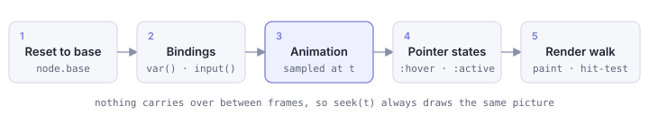

# Popkorn Architecture

How the pipeline fits together. See the [README](../README.md) for setup and the [format reference](reference.md) for syntax.

## Pipeline

### Parser

**@popkorn/parser** is a small tokenizing recursive-descent parser (`src/parser.ts`).
The format is a close CSS dialect, so `parse(source)` turns the source directly into a
typed AST, synchronously, with no dependencies or build step. Parse errors surface through
a structured diagnostics channel (`src/diagnostics.ts`) rather than bare throws, so a
host can point at the offending line. A separate crush mode (`src/crush.ts`) minifies
a scene for shipping. Tests live alongside it in `src/parser.test.ts` (`bun run test`).

### Parser → Player

**@popkorn/player** takes the parsed AST and:

- Builds a scene graph from the AST rules
- Renders shapes through a primitive renderer interface (Canvas2D and SVG on the
  web, Skia on native via `@popkorn/react-native`)
- Animates properties via keyframe interpolation
- Tracks input for interactive variables
- Exposes a `<popkorn-player>` web component

Artboard clipping is on by default: the scene is cropped to the `:root` stage box,
the way an After Effects comp crops to its bounds. `:root { overflow: visible }` opts
out.

### Player → Playground

**@popkorn/playground** is a React app that:

- Uses the `<popkorn-player>` web component via a thin React wrapper
- Provides example scenes to demonstrate features (loaded from
  `examples/popkorn/*.css` by `packages/playground/src/examples.ts`)
- Shows the scene source alongside the rendered output
- Imports real Lottie JSON via the browser-safe converter core

### Design principles

A scene is a description, and the player's job is to turn that description plus a
point in time into a picture. Everything else follows from keeping that relationship
simple. Each frame, every node starts again from the values its rules gave it, then
layers on the dynamic parts in a fixed order:

Because nothing carries over from the previous frame, time behaves like a pure input.
There is one global timeline, and seeking to the same moment twice draws the same
picture, which is what makes scrubbing, looping, and exporting frames to video
dependable. Interaction sits on top of that timeline rather than replacing it: a
`:hover` rule overrides the animated value while the pointer is there, and the
animation carries on underneath.

What you see is also what you can touch. Drawing and hit-testing share the same
transform math, including `transform-origin` and motion-path placement, so a shape
responds to the pointer exactly where it appears on screen. They share the same
ordering too. Siblings paint in document order, `z-index` reorders them the way it
does in CSS, and hit-testing walks that order in reverse, so the topmost shape is the
first one hit.

Animatability is a property of the property. Each animatable property is described
once (as a number, color, gradient, or path) and the interpolator treats every
property of a kind the same way, so adding a new animatable property never means
teaching the animation system a special case.

Finally, the three renderers share their decisions. The logic for how something
should look (gradient geometry, stroke setup, paint state) lives in one shared walk,
and Canvas2D, SVG, and Skia each only translate those decisions into their own
drawing calls. A cross-backend test suite runs the same cases against all three, so a
scene looks the same whichever renderer plays it.

### Lottie converter

`packages/popkorn-converters/src/lottie2popkorn.ts` is the conversion core (browser-safe; the demo
imports it), `packages/popkorn-converters/src/cli.ts` the CLI (`--validate` runs the
output through parse + buildSceneGraph; `--batch <dir>` converts a tree and
prints a clean/warn/blocked table). A normalization layer canonicalizes
real-world bodymovin output (legacy v4 keyframes, split positions, 0-255
colors, missing names) before mapping, so minified production exports convert
alongside hand-tidied ones. The converter handles the large majority of the
LottieFiles test corpus cleanly; the rest convert with warnings or use rare shape
modifiers that Popkorn, like mainstream Lottie players, deliberately leaves out.

### SVG converter

`packages/popkorn-converters/src/svg2popkorn.ts` converts SVG the same way, sharing the
Lottie converter's `Converter`/`convertSvg`/`validate` contract (its own
dependency-free XML reader lives beside it in `svg-xml.ts`). It maps CSS
`@keyframes` and basic SMIL `<animate>`/`<animateTransform>` into Popkorn
`@keyframes` and `animation-*`, and shares the same CLI (`--validate`,
`--batch`) against the fixtures in `examples/svg/`.

Contributors checking rendering changes can use the side-by-side comparison page in
`tools/harness/`, which pauses Popkorn, lottie-web, and ThorVG on the same frame.
